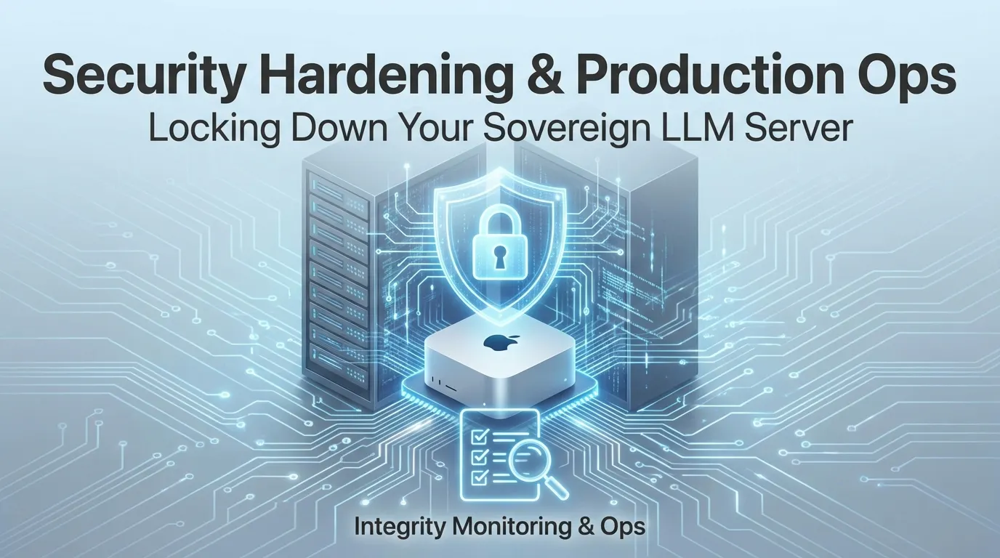

# sovereign-vllm-metal



Companion repository for the **Sovereign LLM Inference on Apple Silicon** article series.

Everything you need to run a production-grade, security-hardened LLM inference server on Mac Studio M4 using vLLM Metal.

## Quick Start

```bash
# 1. Clone this repo
git clone https://github.com/michaelhannecke/sovereign-vllm-metal.git
cd sovereign-vllm-metal

# 2. Install dependencies (pick one)
uv sync                              # using uv (recommended)
pip install -r requirements.txt      # using pip

# 3. Install vLLM Metal (see Part 2 of the article series)
# 4. Download a model
# 5. Copy and adapt the config
cp config/vllm-metal.env.example ~/.vllm-metal-env
# 6. Launch
source ~/.venv-vllm-metal/bin/activate && source ~/.vllm-metal-env
vllm serve ~/models/llama-3.2-3b --host 127.0.0.1 --port 8000 --api-key "${VLLM_API_KEY}"
```

## Repository Structure

```text
sovereign-vllm-metal/
├── scripts/
│   ├── verify_model.py                    # Model integrity verification
│   ├── sovereign_chat.py                  # Interactive chatbot client
│   └── integrity_check.sh                 # Runtime integrity monitoring
├── config/
│   ├── vllm-metal.env.example             # Environment variables
│   ├── local.vllm.metal.plist             # launchd service daemon
│   └── local.vllm.metal-integrity.plist   # launchd integrity check
├── pyproject.toml                         # uv / PEP 621 project metadata
├── requirements.txt                       # pip-compatible dependencies
├── uv.lock                                # uv lockfile
└── README.md
```

## Scripts

### `verify_model.py`

Verify local model files against `CHECKSUMS.sha256` in the model directory. Computes SHA256 hashes and compares against stored baselines.

```bash
python scripts/verify_model.py ~/models/llama-3.2-3b
```

### `sovereign_chat.py`

Interactive chatbot client using the OpenAI Python SDK. Maintains conversation history, logs all turns to local JSONL files.

```bash
source ~/.vllm-metal-env
python scripts/sovereign_chat.py
```

Environment variables:

- `VLLM_BASE_URL` (default: `http://127.0.0.1:8000/v1`)
- `VLLM_API_KEY` (required)
- `VLLM_MODEL` (default: `llama-3.2-3b`)

### `integrity_check.sh`

Daily integrity monitor. Verifies model weight checksums and Python environment haven't changed since initial setup.

```bash
chmod +x scripts/integrity_check.sh
./scripts/integrity_check.sh
```

## Config

### `vllm-metal.env.example`

Template for environment variables. Copy to `~/.vllm-metal-env` and generate an API key.

### `local.vllm.metal.plist`

macOS LaunchDaemon for running vLLM as the `llm-service` user. Install to `/Library/LaunchDaemons/`.

### `local.vllm.metal-integrity.plist`

macOS LaunchDaemon for daily integrity checks at 06:00. Install to `/Library/LaunchDaemons/`.

## Article Series

1. [**Why Sovereign LLM Inference on Apple Silicon**](https://medium.com/@michael.hannecke/why-sovereign-llm-inference-on-apple-silicon-341fdd7daf60) — Architecture, hardware sizing, compliance
2. [**Hands-On: vLLM Metal on Mac Studio M4**](https://medium.com/@michael.hannecke/hands-on-vllm-metal-on-mac-studio-m4-6263062c8c2d) — Installation, model setup, chatbot
3. [**Security Hardening & Production Ops**](https://medium.com/@michael.hannecke/security-hardening-production-ops-for-sovereign-llm-inference-1e25e85accc6) — Service accounts, firewall, launchd, monitoring

## Requirements

- Mac Studio M4 (64GB unified memory recommended)
- macOS 14 Sonoma or 15 Sequoia
- Python 3.12
- vLLM Metal v0.1.0+

## License

Apache 2.0
